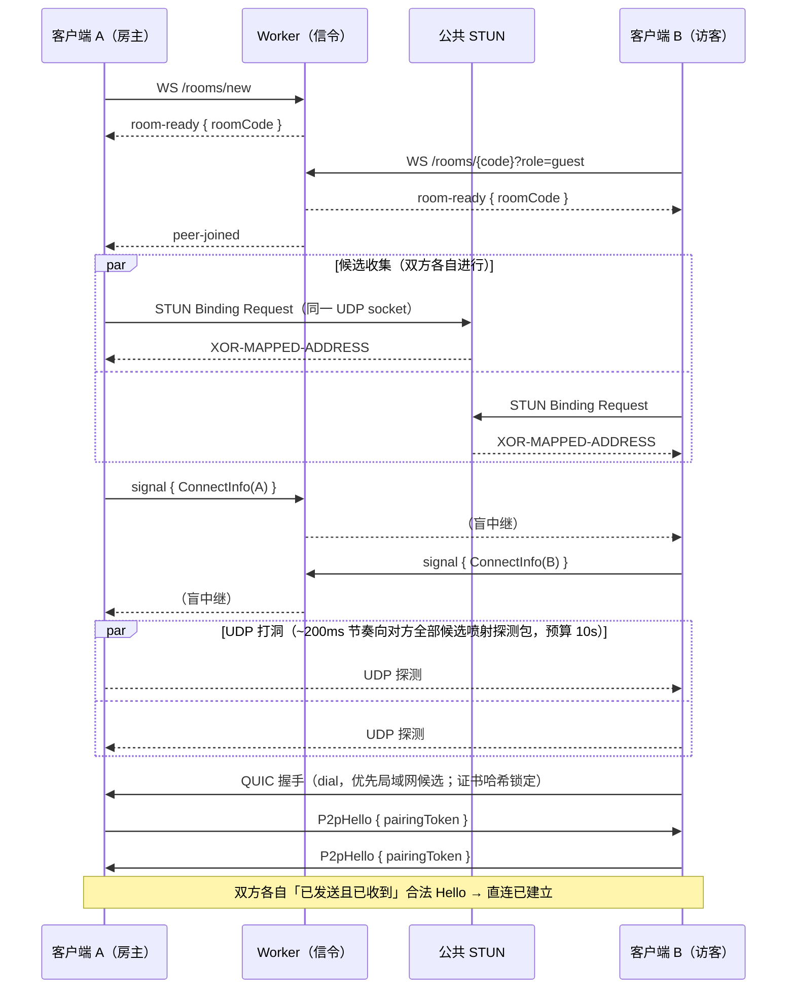

# p2p-signaling

一对一 P2P 数据传输工具：两台内网客户端通过信令服务器以 **4 位房间码**配对，随后进行 NAT 打洞建立**点对点直连通道**，聊天消息（以及后续的文件传输）不再经过任何中间服务器。服务器只负责信令（配对与连接元数据交换），不承载业务数据。

## 目录结构

- `worker/`：Cloudflare Workers (TypeScript + Durable Objects) 信令服务。
- `clients/p2p-core/`：Rust 核心库——信令协议、会话编排、文件传输引擎。
- `clients/p2p-gui/`：Rust `egui` 桌面客户端（聊天 + 可续传文件传输）。
- `scripts/`：客户端构建与启动脚本（macOS / Windows）。

## 总体架构

```
┌────────────┐  ① WS 连接 /rooms/new（房主）        ┌──────────────────────┐
│  客户端 A   │─────────────────────────────────────▶│ CF Worker + RoomDO   │
│  (p2p-gui) │  room-ready { roomCode: "1234" }     │  · 分配 4 位房间码     │
│            │◀─────────────────────────────────────│  · 两端配对(上限 2 人) │
│  p2p-core  │  ③ signal{connect-info} 盲中继        │  · 盲中继 signal 信令  │
│            │◀════════════════════════════════════▶└──────────▲───────────┘
└─────┬──────┘                                                 │ ② WS 连接 /rooms/1234（访客）
      │ ④ UDP 打洞 → QUIC 直连（quinn，证书哈希锁定）       ┌─────┴──────┐
      └══════════ 聊天 /（后续）文件传输，点对点直传 ═══════│  客户端 B   │
                        ▲                                └────────────┘
               ┌────────┴────────┐
               │  公共 STUN 服务  │ （Worker 跑在 Cloudflare 边缘，无法收发 UDP，
               └─────────────────┘   反射地址探测必须依赖外部 STUN）
```

数据路径只有两条：

| 路径 | 承载内容 | 生命周期 |
|---|---|---|
| **信令 WebSocket**（客户端 ↔ Worker） | 房间配对、连接元数据（候选地址/证书哈希/配对令牌）、直连建立前的房间事件 | 直连建立后仅保留信令用途（重协商、房间生命周期） |
| **直连 QUIC**（客户端 ↔ 客户端） | 聊天消息、（后续）文件分块 | 打洞成功后建立；断开即会话结束（见「失败策略」） |

## 房间与信令协议

### 房间码分配流程（服务器分配）

1. **房主**直接对 `wss://<server>/rooms/new` 发起 WebSocket 升级。Worker 随机生成 4 位数字码，向对应 Durable Object 转发升级请求（附 `role=host&create=1`）；若该房间已有房主则返回 409，Worker 换码重试（上限 5 次）。成功后 DO 标记 `hostPresent = true`，向房主发送 `room-ready { roomCode: "1234" }`——**房间码由服务器权威分配**，客户端不再本地生成。
2. **访客**对 `wss://<server>/rooms/<code>?role=guest` 发起升级。DO 在 `hostPresent === false` 时以 404（`room not found`）拒绝——未被房主创建的房间码不可加入。成功后访客收到 `room-ready { roomCode }`，双方收到 `peer-joined`。
3. 每房间上限 2 人，第三个连接被拒（409 `room full`）。

房间生命周期：房间随房主的 WebSocket 存活；**房主断开即关房**（通知访客）。访客断开后房间保留，允许重连（文件续传依赖此行为）。

### 信令 envelope 一览

信令帧为 JSON 文本，`type` 字段区分类型（Rust 侧 `clients/p2p-core/src/signaling.rs` 的 `SignalingEnvelope`，TS 侧 `worker/src/index.ts` 的 `SignalEnvelope`，两处需人工保持同步）：

| type | 方向 | 字段 | 说明 |
|---|---|---|---|
| `room-ready` | 服务器 → 客户端 | `roomCode` | 入房成功，携带服务器分配/确认的房间码 |
| `peer-joined` | 服务器 → 客户端 | `role` | 对端加入 |
| `peer-left` | 服务器 → 客户端 | `role` | 对端离开 |
| `error` | 服务器 → 客户端 | `message` | 协议错误 |
| `hello` | 客户端 → 服务器 | `role`, `roomCode?` | 兼容保留（角色已改由连接 URL 的 query 参数携带） |
| `signal` | 客户端 ↔ 客户端（盲中继） | `payload` | **直连协商载体**，见下文 `ConnectInfo` |
| `chat` | 客户端 ↔ 客户端（盲中继） | `text` | 聊天消息（直连建立前的过渡期 / Phase 4 后移至 QUIC） |
| `file-offer` / `file-accept` / `file-reject` / `file-resume` / `file-chunk` / `file-ack` / `file-complete` / `file-cancel` | 客户端 ↔ 客户端（盲中继） | 见 `transfer.rs` | 文件传输（Phase 5 迁移至 QUIC 后退役） |
| `bye` | 客户端 → 服务器 | — | 主动离房 |

### `signal` 载荷：`ConnectInfo`（Phase 2 引入）

直连协商复用现有 `signal` envelope（Worker 盲中继，**零服务端改动**），内层 payload 为带 `kind` 标签的 JSON：

```jsonc
{
  "kind": "connect-info",
  "version": 1,
  "role": "host",                       // host = QUIC accept 侧，guest = dial 侧
  "candidates": [
    { "addr": "192.168.1.5:53000", "kind": "local" },             // 本机网卡地址（局域网直连）
    { "addr": "203.0.113.7:54321", "kind": "server-reflexive" },  // STUN 反射地址（跨 NAT）
    { "addr": "[2001:db8::1]:53000", "kind": "local" }            // IPv6 全局地址（若有，成功率最高）
  ],
  "certHash": "sha256 十六进制",         // 本端自签 QUIC 证书 DER 的 SHA-256，用于哈希锁定
  "pairingToken": "32 字节随机数 base64" // 配对令牌，双方确认时校验
}
```

`version` + `kind` 保证向前兼容；后续可增加 `{"kind": "connect-result", ...}` 用于重协商诊断。

## 直连建立流程（NAT 穿透）



要点：

- **单 UDP socket**：STUN 探测、打洞、QUIC 共用同一个本地 socket，保证 NAT 映射一致。
- **候选优先级**：访客 dial 时先试 `local` 候选（同一局域网内瞬时可达，无需打洞），再试反射地址；IPv6 全局地址若两端都有则往往无需打洞。
- **证书信任模型**：两端各自用 `rcgen` 生成自签证书，把 DER 的 SHA-256 经信令通道交换；QUIC 客户端安装自定义 `ServerCertVerifier` 锁定该哈希（与 WebRTC 的 DTLS fingerprint 同一模型），无 CA、无域名。
- **双方确认（缺一不可）**：① QUIC 握手成功且证书哈希匹配；② 控制流上双向交换 `P2pHello { pairingToken }` 且令牌与信令阶段交换值一致。两个条件都满足才触发 `DirectLinkEstablished`，UI 置为「直连已建立」，之后双方才可发送消息。
- **保活与断线检测**：quinn `keep_alive_interval ≈ 10s`、`max_idle_timeout ≈ 30s`；超时视为链路断开。

## 直连数据协议

### 控制流（Phase 4）

一条长期存活的 QUIC 双向流，帧格式：`u32 小端长度前缀 + serde JSON`。

```rust
enum P2pMessage {
    Hello { token: String },   // 双方确认
    Ping,
    Pong,
    Chat { text: String },
    // 后续：文件传输控制消息（offer/accept/ack/resume/cancel）
}
```

JSON 便于调试且复用 serde；长度前缀使得单个消息类型日后切换二进制编码时框架层无需变更。

### 文件传输预留设计（Phase 5，暂不实现）

- 分块数据走 **QUIC 单向流（uni-stream）**：每条流以小 JSON 头开始（`transferId`、分块索引范围），其后是**原始字节**——不再 base64（当前经 Worker 中继的方案有 ~33% 编码膨胀），分块可增大到 256 KiB+，背压由 QUIC 流控天然提供。
- 控制消息（offer/accept/reject/resume/ack/complete/cancel）成为 `P2pMessage` 变体。
- `TransferRuntime` 的清单/RangeSet/续传逻辑与传输层无关，迁移点仅是替换其消息发送 sink。
- 迁移完成前，文件传输继续走现有 WebSocket 中继路径（当前行为，功能完整可用）。

## 失败策略

**打洞失败 = 硬失败**（设计决策：数据永不回落到服务器中转）：

- 打洞 + QUIC 握手总预算约 10 秒；超时或握手失败则向用户报错（「直连建立失败」），会话不可发送消息。
- 典型失败场景：两端均为对称 NAT / 运营商级 NAT（CGNAT），出口端口不可预测，喷射探测无法命中。
- UI 提供「重试直连」：重新收集候选并再次打洞（NAT 反射端口会变化，重试有一定成功率）。
- Worker 不可能充当 TURN 中继（Cloudflare Workers 无 UDP 能力），也不引入第三方 TURN——这是「不经过中间服务器」目标的直接推论。

## 实施路线图

| 阶段 | 内容 | 验收标准 | 状态 |
|---|---|---|---|
| **Phase 1** | **服务器分配房间码**：`/rooms/new` 路由 + DO claim 重试；`hostPresent` 门禁（无房主的码不可加入）；`room-ready` 携带 `roomCode`；客户端删除本地 `random_room_code`，从事件获取服务器码 | 房主看到服务器返回的码；访客加入不存在的码收到明确报错；第三客户端 409 | ✅ 已完成 |
| **Phase 2** | **候选收集与交换**：`p2p-core/src/nat.rs` 手写最小 STUN Binding 客户端（单一消息类型，不引入 STUN 依赖）+ 本机网卡枚举；STUN 列表可配置（`P2P_STUN_SERVERS`，默认含大陆可达服务器，Google/Cloudflare 兜底，最多 3 个并发查询取应答）；`ConnectInfo` 定义与收发（替换 `session.rs` 中对 `Signal` 的丢弃） | 两端在不同网络/同一局域网下能互相打印对方候选列表 | ✅ 本次 |
| **Phase 3** | **打洞 + QUIC 通道**：`p2p-core/src/direct.rs`——共享 UDP socket、打洞循环、quinn Endpoint（房主 accept / 访客 dial）、rcgen 自签证书 + 哈希锁定、pairing token 校验；事件 `DirectLinkEstablished / Failed / Lost`。新增依赖：`quinn`（**rustls-ring** feature，禁用 aws-lc-rs 以免 Windows 构建依赖 NASM/CMake）、`rcgen`；现有 WebSocket 的 native-tls 不变 | 同局域网与两个典型家用 NAT 之间直连成功；失败路径 10s 内干净超时报错 | 待做 |
| **Phase 4** | **聊天走直连 + UI 状态**：`p2p-core/src/p2p_proto.rs` 帧协议、Hello/Ping/Pong/Chat；聊天发送切换到 QUIC；`ConnectionState` 增加 `Direct`（绿色「直连」徽标）与失败态；「重试直连」按钮 | 直连模式下 Worker 零聊天帧经过（可用中继计数验证）；断网观察到明确的失败提示 | 待做 |
| **Phase 5** | **文件传输迁移 QUIC**：分块走二进制 uni-stream，控制消息并入 `P2pMessage`，中继路径退役 | 大文件传输成功且续传逻辑不回归 | 待做 |

## 本地开发与构建

### 检查

```sh
cd clients
cargo check --workspace
cargo test --workspace
```

Worker：

```sh
cd worker
npm install
npm run typecheck
npm run dev        # wrangler dev，默认 http://127.0.0.1:8787
```

### 客户端构建与启动脚本

macOS：

```sh
./scripts/build-client-macos.sh
# 房主（房间码由服务器分配，无需 --room）：
./scripts/start-client-macos.sh --server p2p-signaling.yizhe.studio --role host
# 访客（输入房主展示的 4 位码）：
./scripts/start-client-macos.sh --server p2p-signaling.yizhe.studio --room 1234 --role guest
```

`scripts/start-client-macos.command` 支持从 Finder 双击启动。

Windows PowerShell：

```powershell
.\scripts\build-client-windows.ps1
.\scripts\start-client-windows.ps1 -Server p2p-signaling.yizhe.studio -Role host
.\scripts\start-client-windows.ps1 -Server p2p-signaling.yizhe.studio -Room 1234 -Role guest
```

Windows cmd：

```bat
scripts\build-client-windows.cmd
scripts\start-client-windows.cmd -Server p2p-signaling.yizhe.studio -Role host
scripts\start-client-windows.cmd -Server p2p-signaling.yizhe.studio -Room 1234 -Role guest
```

### 环境变量

- `P2P_SIGNALING_SERVER`：信令服务器地址（裸域名走 `wss://`；`localhost`/`127.*` 自动走 `ws://`）。
- `P2P_SIGNALING_ROOM`：4 位房间码，**仅访客需要**（房主的码由服务器分配，此变量被忽略）。
- `P2P_SIGNALING_ROLE`：`host` / `guest`。
- `P2P_STUN_SERVERS`：（Phase 2 起）逗号分隔的 STUN 服务器列表，覆盖默认值。

### 部署

Worker 通过 GitHub Actions 手动触发部署（`.github/workflows/deploy.yml`，需要 `CLOUDFLARE_ACCOUNT_ID` / `CLOUDFLARE_API_TOKEN` secrets），或本地 `cd worker && npm run deploy`。

## 文件传输（当前行为）

两个客户端入房后，点击桌面客户端的「文件」发送文件。接收方选择保存位置并确认接收后，按 `32 KiB` 分块传输，逐块 SHA-256 校验，已完成范围持久化在系统本地数据目录 `p2p-signaling/transfers` 下的清单文件中。

客户端断线或重启后重新加入同一房间，待完成的收发清单会重新广播，仅请求缺失分块。当前文件字节仍经 Worker 中继（base64 文本帧）；迁移到 QUIC 直连见路线图 Phase 5。Worker 不存储任何文件字节。

## 安全性说明

- **传输加密**：信令走 WSS（Cloudflare 终结 TLS）；直连通道为 QUIC 内建 TLS 1.3。
- **证书锁定**：自签证书哈希经由已加密的信令通道交换，QUIC 握手时锁定校验，防止直连通道被第三方冒充。
- **配对令牌**：32 字节随机令牌绑定「这条 QUIC 连接属于这个房间的这两个人」，即使有人碰巧探测到你的反射地址也无法通过确认。
- **房间码熵有限**：4 位数字仅 10^4 空间，定位是低摩擦配对而非访问控制；`hostPresent` 门禁 + 2 人上限 + 配对令牌缓解爆破，若需更高强度可将码长升至 6 位。

## 已知限制

- 两端均为对称 NAT / CGNAT 时打洞必然失败，且按设计**不回退中继**——此场景下无法建立会话（IPv6 可用时可显著缓解）。
- 大陆网络无法访问 Google STUN，默认列表须包含境内可达服务器（`P2P_STUN_SERVERS` 可覆盖）。
- 直连建立后信令 WebSocket 长期空闲，Cloudflare 可能回收连接；需应用层 ping（约 30–55s）或后续迁移到 DO WebSocket Hibernation API。
- 信令协议在 Rust（`signaling.rs`）与 TypeScript（`index.ts`）中各有一份定义，修改时必须两处同步。
